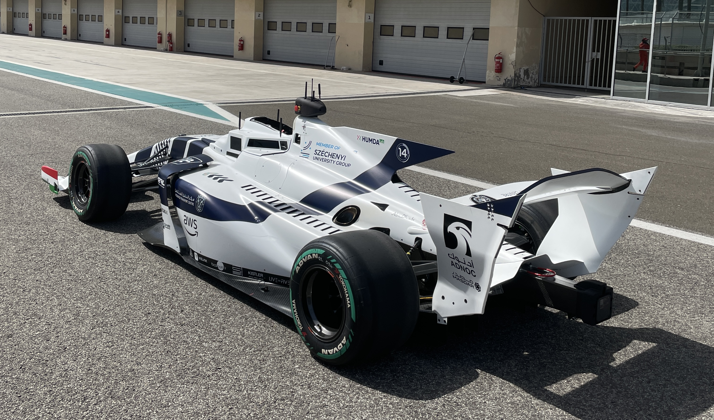

## Hello, World! 🌍

<p align='left'>
I am a Robotics Research Engineer with a passion for pushing the boundaries of what's possible in autonomous systems.
My primary areas of interest include environment perception, reinforcement learning, and computer vision.
</p>



[](mailto:al.r.falah@gmail.com)

> "Given two rewarding stimuli, animals tend to choose the more rewarding (or less effortful) option. However, they also move faster toward that stimulus."

<!--
```python
def main():
    name = "[Your Name]"
    location = "[Your Location]"
    favorite_editor = "[Your Favorite Editor]"

    print(f"\nName: {name}")
    print(f"Living in: {location}")
    print(f"Favourite editor: {favorite_editor}\n")

if __name__ == "__main__":
    main()
